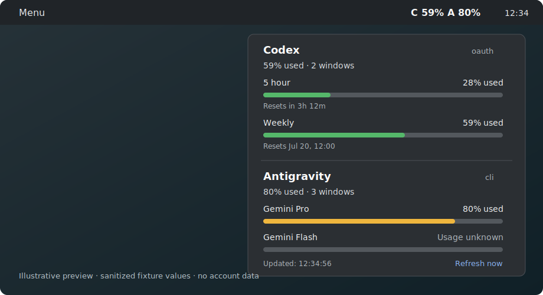

# Codex & Antigravity Usage

English | [日本語](README.ja.md)

A Linux Mint Cinnamon panel applet that displays OpenAI Codex and Google Antigravity quota usage
from the [CodexBar](https://github.com/steipete/CodexBar) Linux CLI. Each provider refreshes
independently, so a failure in one does not hide valid data from the other.



_Illustrative preview rendered from sanitized fixture values; it contains no account data._

## Features

- Compact panel text for Codex and Antigravity, with used or remaining percentages
- Every quota window returned by CodexBar, including named model groups and reset times
- Worst-known-window summary instead of assuming `usage.primary` is representative
- Correct distinction between 0%, unknown usage, stale data, and initial errors
- Independent provider failures, last-known-good values, manual refresh, and a 25-second timeout
- No direct OAuth, cookie, credential, internal Google API, or localhost language-server access

## Requirements

- Linux Mint Cinnamon or another Cinnamon desktop supporting local applets
- [CodexBar Linux CLI](https://github.com/steipete/CodexBar/blob/main/docs/cli.md)
- Codex CLI signed in for Codex quota data
- Antigravity or `agy` signed in for Antigravity quota data
- `lsof` for CodexBar's local Antigravity discovery
- Optional: `jq` for detailed redacted diagnostic JSON
- Optional for development only: Node.js 18 or newer

This release was validated with CodexBar v0.43.0 on Linux x86_64. Download release artifacts only
from the [official release page](https://github.com/steipete/CodexBar/releases/tag/v0.43.0) and verify
the archive against its adjacent SHA256 file before installing it.

Confirm the backend before installing the applet:

```bash
command -v codexbar
codexbar --version
codexbar config validate --format json --pretty
codexbar usage --provider codex --format json --pretty
codexbar usage --provider antigravity --source auto --format json --pretty
```

If CodexBar is outside the Cinnamon process PATH, set an absolute path in the applet settings.
The applet also checks common locations such as `~/.local/bin/codexbar` and
`/opt/apps/codexbar/codexbar` without starting a login shell.

## Install

From this checkout:

```bash
./scripts/install.sh
```

Then open **System Settings -> Applets**, select **Codex & Antigravity Usage**, and add it to the
panel. Remove and re-add the applet or restart Cinnamon after updating its JavaScript or CSS.

The installer creates only this symlink:

```text
~/.local/share/cinnamon/applets/codex-agy-usage@local
```

It is idempotent for the same checkout. It refuses to replace a real directory and requires
`--force` before replacing a symlink to a different checkout.

To uninstall:

```bash
./scripts/uninstall.sh
```

Uninstalling does not remove CodexBar, Codex CLI, Antigravity, `agy`, configuration, or credentials.

## Settings

| Setting | Default | Description |
| --- | --- | --- |
| CodexBar command path | `codexbar` | Executable name or explicit path |
| Show Codex | On | Enable Codex refresh and display |
| Show Antigravity | On | Enable Antigravity refresh and display |
| Refresh interval | 60 seconds | 30 to 3600 seconds, in 30-second steps |
| Displayed percentage | Used | Switch between used and remaining percentages |

Internally, quota values always remain `usedPercent`. Warning colors therefore continue to mean
quota pressure even when the displayed number is the remaining percentage.

## Antigravity behavior and limitations

CodexBar owns provider detection, authentication, TLS, and all Antigravity protocol handling. In
`auto` mode it may use the Antigravity app, the `agy` CLI, an IDE language server, or configured
OAuth. Local acquisition may require the Antigravity app or `agy` to be available. OAuth can
identify an account while Google still declines to return quota limits; this is shown as
**Signed in; limits unavailable**.

Some windows expose a reset time without a usage percentage. They remain visible as **Usage
unknown** and never count as 0%, 100%, or a warning. The internal Antigravity protocol can change;
compatibility updates belong primarily in CodexBar rather than this applet.

## Troubleshooting and diagnostics

Run the privacy-preserving diagnostic script:

```bash
./scripts/diagnose.sh
./scripts/diagnose.sh --command /absolute/path/to/codexbar
```

With `jq`, provider JSON is recursively redacted before display. Without `jq`, only provider,
source, usage presence, and error presence are printed. Raw stderr is never printed. Also check:

```bash
journalctl --user -f | grep -Ei 'cinnamon|codex|antigravity'
tail -n 200 ~/.xsession-errors
```

Common panel messages:

- `CodexBar CLI not found`: set the command path or install CodexBar
- `Start Antigravity or agy`: start or sign in to an Antigravity source
- `Signed in; limits unavailable`: the account was recognized but quota data was unavailable
- `Invalid CodexBar JSON`: inspect the configured command manually
- A trailing `~`: the displayed value is the last successful value and is stale

## Privacy and security

The applet launches CodexBar with an argv array. It never uses `sh -c`, reads authentication files,
stores tokens, opens a browser, contacts Google or OpenAI directly, scans credential directories,
or emits telemetry. Provider JSON and account data are kept in memory and are not logged or
persisted. Errors are redacted and limited to 300 characters.

Captured test fixtures use `user@example.invalid` and redact unique identifiers. To sanitize a new
capture before reviewing or committing it:

```bash
node scripts/sanitize-fixture.js /secure/path/raw.json tests/fixtures/new-sanitized.json
```

Never commit the raw capture.

## Development and tests

The Cinnamon runtime uses GJS only; Node.js is not a runtime dependency. Pure normalization and
formatting modules expose a small CommonJS bridge solely for tests:

```bash
npm test
node --check applet.js
bash -n scripts/install.sh scripts/uninstall.sh scripts/diagnose.sh
```

The normalizer accepts single objects and arrays, exact provider selection, current nested named
windows, known legacy paths, missing fields, unknown usage, additional fields, malformed JSON, and
partial errors. It deliberately does not recursively search arbitrary objects for percentages.

## Upstream attribution

This project is based on
[jacobcalvert/codexbar-cinnamon-applet](https://github.com/jacobcalvert/codexbar-cinnamon-applet)
at commit `2b5ad38fb49aff4ad1d2eb4dc9781eb200a38b4d`. The original MIT copyright notice is retained in
[LICENSE](LICENSE). Usage acquisition is delegated to
[steipete/CodexBar](https://github.com/steipete/CodexBar), also MIT licensed.

The main differences from the base applet are simultaneous dual-provider display, independent
refresh state, a schema-tolerant normalization layer, all-window rendering, unknown and stale
semantics, safe command discovery, tests, and distribution/diagnostic tooling.
