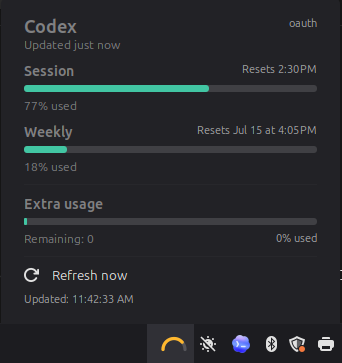

# CodexBar Cinnamon Applet

A Linux Mint Cinnamon panel applet for displaying Codex usage from
[steipete/CodexBar](https://github.com/steipete/CodexBar).

The applet runs the `codexbar` CLI, reads its JSON output, and shows a compact
panel gauge based on the primary usage window. Clicking the applet opens a small
details popup with session, weekly, extra usage, cost, refresh status, and error
information when available.



## Provider Support

The applet is confirmed working with the **Codex** provider. Support for the
other providers exposed by CodexBar is still considered beta, and feedback from
testers is welcome. If you try another provider, please report what works, what
does not, and include a sanitized sample of the JSON output when possible.

## Requirements

- Linux Mint Cinnamon, or another Cinnamon desktop that supports local applets
- [CodexBar](https://github.com/steipete/CodexBar) installed and working
- A `codexbar` executable available on your machine

By default, this applet expects CodexBar at:

```sh
/opt/apps/codexbar/codexbar
```

You can change that path in the applet settings after installation.

## Check CodexBar

Before installing the applet, make sure CodexBar can produce JSON:

```sh
/opt/apps/codexbar/codexbar usage --format json --provider codex
```

Provider failures are okay as long as CodexBar still emits JSON. The applet is
designed to show CodexBar error responses instead of crashing.

## Install

Clone this repository:

```sh
git clone <repo-url>
cd codexbar-applet
```

Create Cinnamon's local applets directory if needed:

```sh
mkdir -p ~/.local/share/cinnamon/applets
```

Symlink this checkout into Cinnamon's applet directory:

```sh
ln -s "$PWD" ~/.local/share/cinnamon/applets/codexbar@local
```

Open **System Settings** -> **Applets**, find **CodexBar**, and add it to the
panel.

If the applet does not appear, restart Cinnamon:

1. Press `Alt+F2`
2. Type `r`
3. Press Enter

You can also log out and back in.

## Updating

Pull the latest changes in your checkout:

```sh
git pull
```

Then remove and re-add the applet, or restart Cinnamon, so the updated JavaScript
and stylesheet are reloaded.

## Configuration

Open the applet's settings from Cinnamon's Applets panel.

Available settings:

- **CodexBar command path**: path to the `codexbar` executable
- **Provider**: defaults to `codex`
- **Refresh interval**: defaults to 60 seconds

The applet runs a command like:

```sh
/opt/apps/codexbar/codexbar usage --format json --provider codex
```

## Display

The panel indicator is a tiny gauge sourced from CodexBar's primary limit data:

- `primary.usedPercent` controls the gauge fill
- Green means low usage
- Amber means elevated usage
- Red means usage is near 100%

The popup uses CodexBar's `primary` and `secondary` limit windows for Session
and Weekly usage, and shows additional supported fields when present.

## Troubleshooting

If the applet shows an error, run the configured command manually:

```sh
/opt/apps/codexbar/codexbar usage --format json --provider codex --pretty
```

Common things to check:

- The CodexBar path in applet settings is correct
- CodexBar is installed from [steipete/CodexBar](https://github.com/steipete/CodexBar)
- CodexBar can access the account/provider you selected
- Cinnamon was restarted after installing or updating the applet

Applet logs can usually be viewed with:

```sh
tail -f ~/.xsession-errors
```
